# Introduction: Middle Relievers, Unsung or Unimportant?

## Why Do I Care About These Nobodies?

As an avid baseball fan and regular Fantasy Baseball participant for the
Major Leagues, over the years I’ve been curious about the value of a
group of players that largely go unheralded in Fantasy circles, but
appear to be of great importance to the teams in their pursuit of
winning games: Middle Relievers. This group of pitchers is usually the
initial first few options out of the bullpen to either protect a lead or
keep a run deficit close once the Starting Pitcher has been pulled from
the game. These players are often of less value in Fantasy Baseball
leagues due to their lack of accrual of counting stats - by the design
of their assignment they rarely have the opportunity to earn Wins or
close games to earn Saves and are often tasked with working through the
heart of the opponent’s batting order for the 3rd or 4th time, leaving
them exposed to an inflated ERA.

However, I’ve theorized in my time watching that maintaining a roster of
above average pitchers used in middle reliever role creates great value
to teams in increasing their probability of victory despite not being
top-of-mind roster targets for Fantasy Managers. A recent notable
example of this was in the 2015 World Series, where the Kansas City
Royals cruised to the Championship in just 5 games bolstered by
top-level relief pitching in the 7th and 8th inning beyond trotting out
an excellent closer in the 9th. And so I’d like to investigate this more
fully across the last several seasons of game data to answer the
question: **Does the introduction of a high-level middle reliever have a
significant impact on a team’s ability to win games?** Beyond that
one-player focused inquiry, I’ll attempt to broaden the investigation to
team averages: **Do teams with above-average Middle Relievers have
demonstrably higher winning percentages, and does this change in games
decided by one run?**

## What: Baseball Background Definitions

For those unfamiliar with the game of baseball, a brief description can
be found in the [**Baseball article on
Wikipedia**](https://en.wikipedia.org/wiki/Baseball), the first two
paragraphs of which describe the basics of the game concisely.
Highlighted terms can be referenced in the **Statistics** section of
that article. This investigation will assume the following definition of
a **Middle Reliever**: a *pitcher* who enters the game in the 6th
*inning* or later, but does not finish or earn a *Save* by pitching in
the 9th inning.

The value of a pitching performance will use the definition of an
advanced metric: **Fielding Independent Pitching (FIP)**, which attempts
to assign a value to a pitcher based solely on the outcomes that player
can control, and measures against the averages across the rest of the
league so as to keep the metric relative to the average league pitcher.
From the definition found at the excellent reference website
[**Fangraphs**](https://www.fangraphs.com), FIP is defined with the
following formula:

In this definition are a few shorthand references to key pitching
outcomes:

-   **HR** - *Home Run*
-   **BB** - *Walk* or *Base on Balls*
-   **HBP** - *Hit By Pitch*
-   **K** - *Strikeout*
-   **IP** - *Inning Pitched*

The **FIP Constant** denoted by *F**I**P**l**g* is calculated
using league-wide statistics, with each of the variables with *lg*
subscript denoting a league-wide summation, is defined as such:

In this definition there is the additional reference of
*E**R**A**l**g* or league *Earned Run Average*.

## How: Defining and Building a Middle Reliever Data Set

The data set enabling this investigation is also available publicly via
the Fangraphs site. In this case, I’ve extracted FIP ratings for
pitchers pitching only in the 6th-8th innings when it’s their 1st or 2nd
time facing the batting order to tag Middle Relievers only. The group
was qualified by having thrown a minimum of 20 innings in a given
season. This is available via Fangraph’s [**Splits
Leaderboards**](https://www.fangraphs.com/leaders/splits-leaderboards)
feature. To attempt to review a big enough sample, I’ve used data from
four seasons, 2018-2021

    pitch_data <- read.csv('fangraphs_splits.csv')

# Body: The Way and Shape of the Middle Relief Data Set

## Reviewing the statisical significance of MR FIP

Ideally, since the statistic takes the rest of the league’s performance
each year into account, this will have the look of a **normal
distribution**:

    hist(pitch_data$FIP)

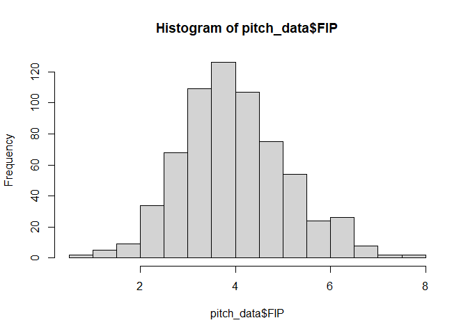

From the histogram above we see that it does indeed hew to the bell
curve of the normal distribution, and so from that we can start to
review the standard statistical facts about the data set:

    summary(pitch_data$FIP)

    ##    Min. 1st Qu.  Median    Mean 3rd Qu.    Max. 
    ##  0.6316  3.2309  3.9079  3.9876  4.6583  7.9700

The Median and Mean bring a few interesting facts about this pitching
scenario when we look at Fangraph’s published [**FIP
Constants**](https://www.fangraphs.com/guts.aspx?type=cn) for the years
we are reviewing:

<table>
<thead>
<tr class="header">
<th>Year</th>
<th>FIP Const</th>
</tr>
</thead>
<tbody>
<tr class="odd">
<td>2018</td>
<td>3.161</td>
</tr>
<tr class="even">
<td>2019</td>
<td>3.214</td>
</tr>
<tr class="odd">
<td>2020</td>
<td>3.191</td>
</tr>
<tr class="even">
<td>2021</td>
<td>3.170</td>
</tr>
<tr class="odd">
<td>—</td>
<td>—</td>
</tr>
<tr class="even">
<td>AVG</td>
<td>3.184</td>
</tr>
</tbody>
</table>

*Right off the bat*, this group is on average numerically worse than the
rest of the pitchers in the league, and the league constant is lower
than even some of those in the 1st quantile of our MR set. This is not
great to help prove their value, but let’s dig a bit deeper. Focusing on
those better than average relievers, we’ll grab standard deviation and
term those relievers one SD above the mean as **good** and two about the
mean as **elite**.

    FIP_SD <- sd(pitch_data$FIP)
    GOOD_MR <- mean(pitch_data$FIP) - FIP_SD
    ELITE_MR <- mean(pitch_data$FIP) - 2*FIP_SD

    ELITE_MR

    ## [1] 1.767593

    GOOD_MR

    ## [1] 2.877594

With these performance categories defined, let’s get a feel for how many
pitchers meet these criteria, broken down by year. At this point we’ll
turn to the **Tidyverse** for some additional tooling, notably the
[**dplyr**](https://dplyr.tidyverse.org/) library to help examine the
data.

    pitch_data %>% count(FIP <= GOOD_MR & FIP > ELITE_MR)

    ##   FIP <= GOOD_MR & FIP > ELITE_MR   n
    ## 1                           FALSE 574
    ## 2                            TRUE  77

    pitch_data %>% count(FIP <= ELITE_MR)

    ##   FIP <= ELITE_MR   n
    ## 1           FALSE 640
    ## 2            TRUE  11

    pitch_data %>% filter(FIP <= ELITE_MR) %>% select(Name, Season, Tm, FIP) %>% arrange(FIP)

    ##               Name Season  Tm       FIP
    ## 1    Taylor Rogers   2021 MIN 0.6315726
    ## 2   Devin Williams   2020 MIL 0.7256664
    ## 3  James Karinchak   2020 CLE 1.3580865
    ## 4    Liam Hendriks   2019 OAK 1.3629461
    ## 5    Evan Marshall   2020 CHW 1.3732380
    ## 6    Matt Andriese   2018 TBR 1.4147814
    ## 7     Ryan Pressly   2018 HOU 1.4735500
    ## 8    Taylor Rogers   2018 MIN 1.6320178
    ## 9   Pete Fairbanks   2021 TBR 1.6482950
    ## 10   Nick Anderson   2019 TBR 1.6902004
    ## 11    Oliver Perez   2018 CLE 1.7210500

So we see that we have just a few elite performances in the 4 year
sample set, with the former Minnesota Twin Taylor Rogers the only
pitcher featured twice on the list.

This should be a sufficient bit of data to analyze individual
performances, but it’s also important to analyze average team
performance, and so we’ll construct a new, smaller data set per Team and
Season that averages out FIP ratings, again using some handy dplyr
functions:

    team_data <- pitch_data %>% select("Season", "Tm", "FIP") %>% group_by(Tm, Season) %>% 
      summarize(Avg_FIP = mean(FIP), .groups = 'drop')

    TEAM_FIP_SD <- sd(team_data$Avg_FIP)
    TEAM_GOOD_MR <- mean(team_data$Avg_FIP) - TEAM_FIP_SD

    TEAM_GOOD_MR

    ## [1] 3.153135

    team_data %>% count(Avg_FIP <= TEAM_GOOD_MR)

    ## # A tibble: 2 x 2
    ##   `Avg_FIP <= TEAM_GOOD_MR`     n
    ##   <lgl>                     <int>
    ## 1 FALSE                        93
    ## 2 TRUE                         11

    team_data %>% filter(Avg_FIP <= TEAM_GOOD_MR) %>% 
      select(Tm, Season, Avg_FIP) %>% arrange(Avg_FIP)

    ## # A tibble: 11 x 3
    ##    Tm    Season Avg_FIP
    ##    <chr>  <int>   <dbl>
    ##  1 MIL     2020   0.726
    ##  2 CLE     2020   1.36 
    ##  3 CHW     2020   1.37 
    ##  4 BOS     2020   2.62 
    ##  5 SDP     2018   2.70 
    ##  6 LAD     2020   2.71 
    ##  7 TBR     2018   2.83 
    ##  8 TBR     2021   2.89 
    ##  9 LAA     2020   2.91 
    ## 10 DET     2020   2.93 
    ## 11 HOU     2018   3.04

In this group we find the most significant team performances over the
past four seasons, of which we’ll look for impact in our analysis. We’re
again starting with only the best performances being better than the
league FIP constant, so on average this set is markedly worse than the
league-average pitcher. Not necessarily a good omen for the impact of
these players, but we’ll let the numbers dictate our findings.

## Merging Pitcher Performance with Team Performance

Now with these two sets in hand, how do they correlate to team
performance, or winning percentage? To find that we turn to another
source, **Baseball Reference** and their [**in-depth historical
standings
data**](https://www.baseball-reference.com/leagues/majors/2021-standings.shtml).
This data was also downloaded and concatenated into single CSV file,
with the team names translated to match the Fangraphs data.

    standings <- read.csv('standings18-21.csv')

In particular we’ll be interested in the teams’ Win/Loss %, both overall
and in 1-run games. Because 1-Run W/L% is not calculated, we’ll quickly
add that using dplyr’s **mutate** and **select** functions to create the
new column and trim the data set to just the columns of interest. To
make this process more repeatable, the calculation will be done in a
custom function **calc\_wl\_str**, which will employ the Tidyverse
[**stringr**](%22https://stringr.tidyverse.org%22) library:

    calc_wl_str <- function(wl_str) {
      wl <- str_extract_all(wl_str, "\\d{1,2}", simplify = TRUE)
      w <- strtoi(wl[1])
      l <- strtoi(wl[2])
      return(w / (w + l))
    }

    calc_wl_str_v <- Vectorize(calc_wl_str)

    standings <- standings %>% mutate(W.L1 = calc_wl_str_v(X1Run)) %>%
      select("Season", "Tm", "W.L.", "W.L1")

With these calculations made we’ll make two final preparations for
analysis: merge team performance data into the pitcher and team data
sets.

    pitch_merge <- pitch_data %>% select("Name", "Season", "Tm", "IP", "FIP") %>%
      left_join(standings, by = c("Season", "Tm"))

    team_merge <- team_data %>% left_join(standings, by = c("Season", "Tm"))

## Performing Regression Analysis on the Merged Data

And so we arrive at our opportunity to analyze these compiled data.
We’ll use standard linear regression to compare the FIP data against
team’s Win/Loss percentage. It’s notable that **we’ll be looking for a
negative correlation** in this comparison, as lower FIP is better as
opposed to higher Win/Loss%.

### All Middle Relievers

[**ggplot**](%22https://ggplot2.tidyverse.org%22), again provided by the
Tidyverse, will be our visualization tool for all of the review to
follow. First a look for any correlation between FIP and all teams’
W/L%:

    pitch_merge %>% ggplot(., aes(x=FIP, y= W.L.)) + 
      geom_point() + geom_smooth(method="lm", formula = "y ~ x")

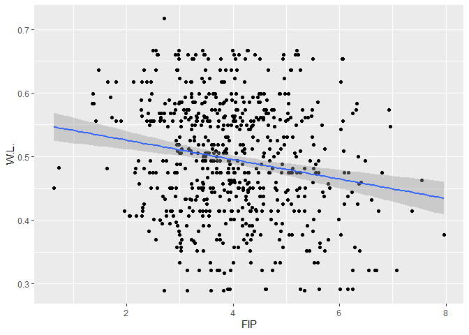

    summary(lm(W.L.~FIP, data=pitch_merge))

    ## 
    ## Call:
    ## lm(formula = W.L. ~ FIP, data = pitch_merge)
    ## 
    ## Residuals:
    ##       Min        1Q    Median        3Q       Max 
    ## -0.225258 -0.065255  0.002651  0.068571  0.201776 
    ## 
    ## Coefficients:
    ##              Estimate Std. Error t value Pr(>|t|)    
    ## (Intercept)  0.556631   0.013271   41.94  < 2e-16 ***
    ## FIP         -0.015293   0.003206   -4.77 2.28e-06 ***
    ## ---
    ## Signif. codes:  0 '***' 0.001 '**' 0.01 '*' 0.05 '.' 0.1 ' ' 1
    ## 
    ## Residual standard error: 0.09074 on 649 degrees of freedom
    ## Multiple R-squared:  0.03387,    Adjusted R-squared:  0.03238 
    ## F-statistic: 22.75 on 1 and 649 DF,  p-value: 2.281e-06

We do have a gentle negative correlation through the data set, but with
the majority of the data muddled in the middle of the plot and with very
low R-squared values, this correlation appears to be very weak.

Do this change for 1-Run Games?

    pitch_merge %>% ggplot(., aes(x=FIP, y= W.L1)) + 
      geom_point() + geom_smooth(method="lm", formula = "y ~ x")

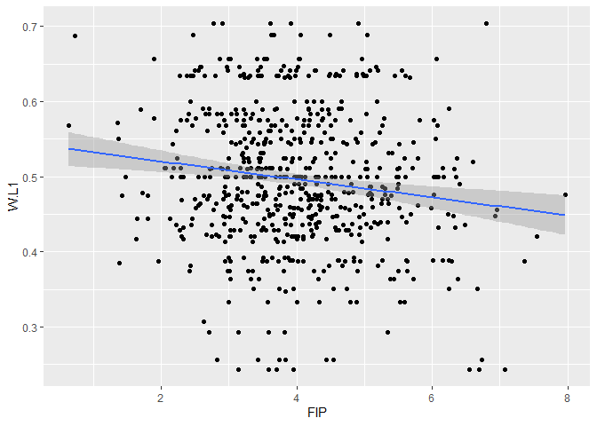

    summary(lm(W.L1~FIP, data=pitch_merge))

    ## 
    ## Call:
    ## lm(formula = W.L1 ~ FIP, data = pitch_merge)
    ## 
    ## Residuals:
    ##       Min        1Q    Median        3Q       Max 
    ## -0.262940 -0.056359 -0.004978  0.062032  0.240774 
    ## 
    ## Coefficients:
    ##              Estimate Std. Error t value Pr(>|t|)    
    ## (Intercept)  0.544394   0.013467  40.424  < 2e-16 ***
    ## FIP         -0.011970   0.003254  -3.679 0.000254 ***
    ## ---
    ## Signif. codes:  0 '***' 0.001 '**' 0.01 '*' 0.05 '.' 0.1 ' ' 1
    ## 
    ## Residual standard error: 0.09208 on 649 degrees of freedom
    ## Multiple R-squared:  0.02043,    Adjusted R-squared:  0.01892 
    ## F-statistic: 13.53 on 1 and 649 DF,  p-value: 0.0002537

It appears not, and is seemingly even less correlated than the larger
record set.

### Elite/Good Middle Relievers

Not great results so far, but let’s now look for any correlations among
our Elite and Good relievers sets. First a comparison of Elite MRs to
their teams’ W/L%:

    pitch_merge %>% filter(FIP <= ELITE_MR) %>% ggplot(., aes(x=FIP, y= W.L.)) + 
      geom_point() + geom_smooth(method="lm", formula = "y ~ x")

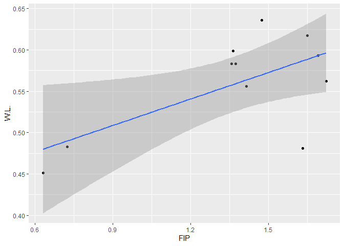

This correlation is actually *positive*, which is the worst outcome in
our case, denoting that the most elite middle relief performances were
on teams with losing records, unable to to move the needle of mediocrity
in any significant way.

Does this improve when the Good MR group is included?

    pitch_merge %>% filter(FIP <= GOOD_MR) %>% ggplot(., aes(x=FIP, y= W.L.)) + 
      geom_point() + geom_smooth(method="lm", formula = "y ~ x")

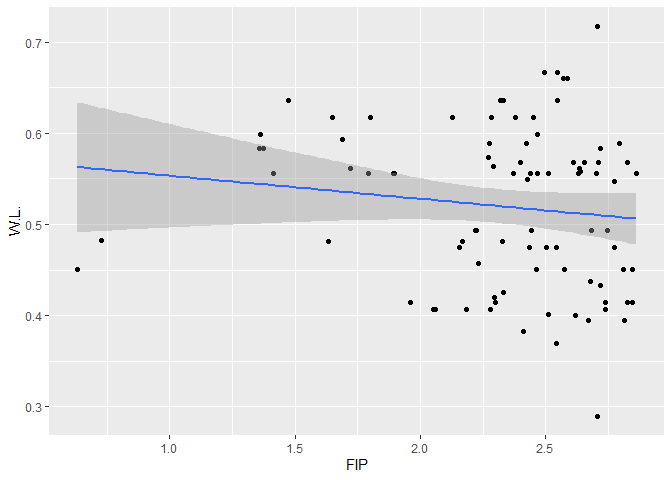

Only slightly, with a look very similar to our overall regression set.

As before, let’s now turn to the 1-Run game percentages for a possible
correlation in close-game situations:

    pitch_merge %>% filter(FIP <= ELITE_MR) %>% ggplot(., aes(x=FIP, y= W.L1)) + 
      geom_point() + geom_smooth(method="lm", formula = "y ~ x")

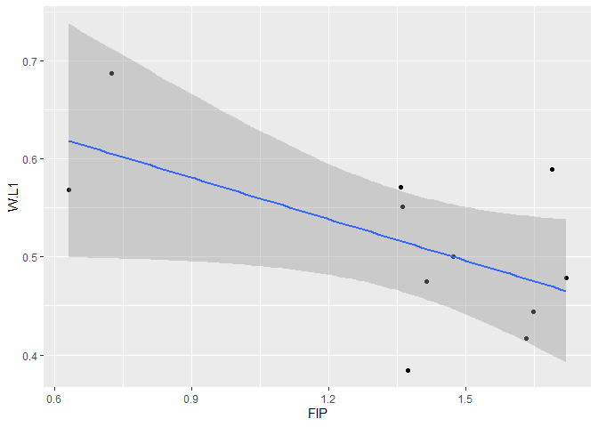

This provides us our strongest correlation seen yet, albeit on the
smallest data set. Does this hold up for with the Good MRs included?

    pitch_merge %>% filter(FIP <= GOOD_MR) %>% ggplot(., aes(x=FIP, y= W.L1)) + 
      geom_point() + geom_smooth(method="lm", formula = "y ~ x")

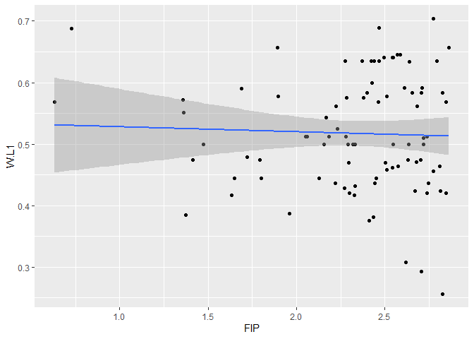

It does not. So without any strong correlations coming out of the
individual performances in the context of team success, we’ll turn to
team performances to affect team success.

### Team Trends

First a look, as before, at all MRs against their team winning
percentage.

    team_merge %>% ggplot(., aes(x=Avg_FIP, y= W.L.)) + 
      geom_point() + geom_smooth(method="lm", formula = "y ~ x")

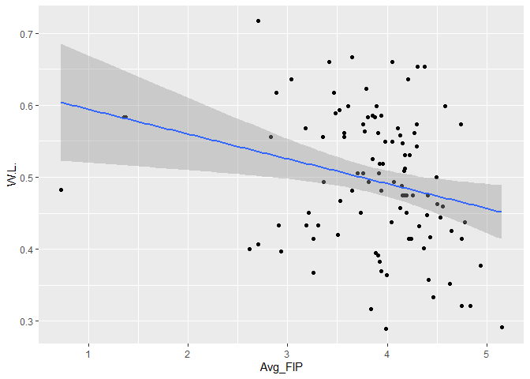

    summary(lm(W.L.~Avg_FIP, data=team_merge))

    ## 
    ## Call:
    ## lm(formula = W.L. ~ Avg_FIP, data = team_merge)
    ## 
    ## Residuals:
    ##       Min        1Q    Median        3Q       Max 
    ## -0.201691 -0.069182  0.000974  0.068429  0.181229 
    ## 
    ## Coefficients:
    ##             Estimate Std. Error t value Pr(>|t|)    
    ## (Intercept)  0.62910    0.05012  12.552  < 2e-16 ***
    ## Avg_FIP     -0.03447    0.01280  -2.694  0.00826 ** 
    ## ---
    ## Signif. codes:  0 '***' 0.001 '**' 0.01 '*' 0.05 '.' 0.1 ' ' 1
    ## 
    ## Residual standard error: 0.09106 on 102 degrees of freedom
    ## Multiple R-squared:  0.06643,    Adjusted R-squared:  0.05727 
    ## F-statistic: 7.257 on 1 and 102 DF,  p-value: 0.008257

    team_merge %>% ggplot(., aes(x=Avg_FIP, y= W.L1)) + 
      geom_point() + geom_smooth(method="lm", formula = "y ~ x")

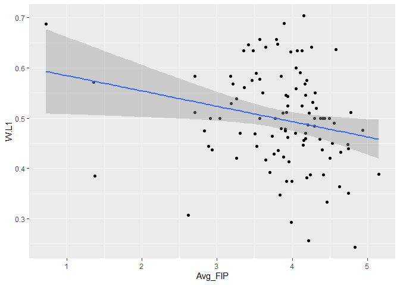

    summary(lm(W.L1~Avg_FIP, data=team_merge))

    ## 
    ## Call:
    ## lm(formula = W.L1 ~ Avg_FIP, data = team_merge)
    ## 
    ## Residuals:
    ##       Min        1Q    Median        3Q       Max 
    ## -0.230364 -0.058723 -0.000553  0.059212  0.214866 
    ## 
    ## Coefficients:
    ##             Estimate Std. Error t value Pr(>|t|)    
    ## (Intercept)  0.61532    0.05185  11.868   <2e-16 ***
    ## Avg_FIP     -0.03047    0.01324  -2.302   0.0234 *  
    ## ---
    ## Signif. codes:  0 '***' 0.001 '**' 0.01 '*' 0.05 '.' 0.1 ' ' 1
    ## 
    ## Residual standard error: 0.0942 on 102 degrees of freedom
    ## Multiple R-squared:  0.04937,    Adjusted R-squared:  0.04005 
    ## F-statistic: 5.298 on 1 and 102 DF,  p-value: 0.02339

Both sets exhibit an improvement in correlation to a team’s overall
performance and in 1-Run games, but even with the improvement of
R-Squared values roughly doubling, the correlation is still extremely
weak.

Does this change when we look at those teams with Good average FIP?

    team_merge %>% filter(Avg_FIP <= TEAM_GOOD_MR) %>% ggplot(., aes(x=Avg_FIP, y= W.L.)) + 
      geom_point() + geom_smooth(method="lm", formula = "y ~ x")

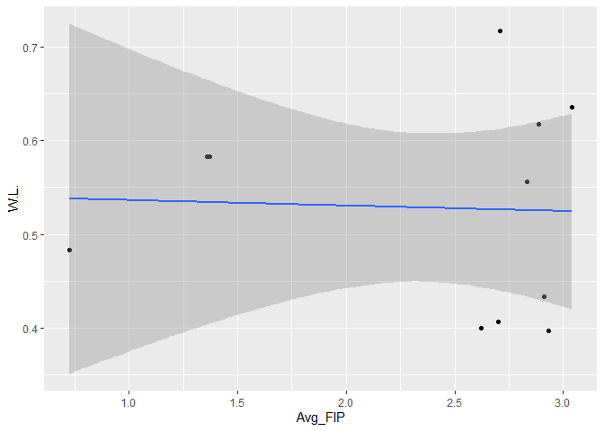

    team_merge %>% filter(Avg_FIP <= TEAM_GOOD_MR) %>% ggplot(., aes(x=Avg_FIP, y= W.L1)) + 
      geom_point() + geom_smooth(method="lm", formula = "y ~ x")

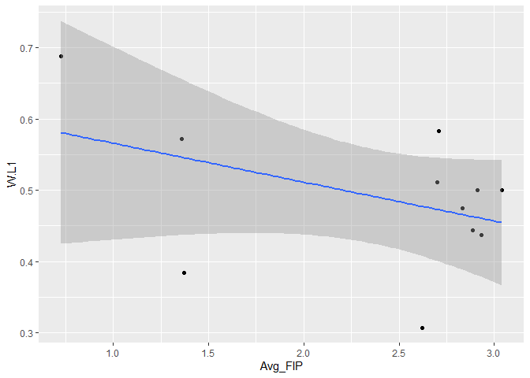

Overall W/L% is almost completely non-correlated and 1-Run game
performance is only as loosely correlated as before.

Our final check will be on any teams with above average performance:

    team_merge %>% filter(Avg_FIP <= mean(Avg_FIP)) %>% ggplot(., aes(x=Avg_FIP, y= W.L.)) + 
      geom_point() + geom_smooth(method="lm", formula = "y ~ x")

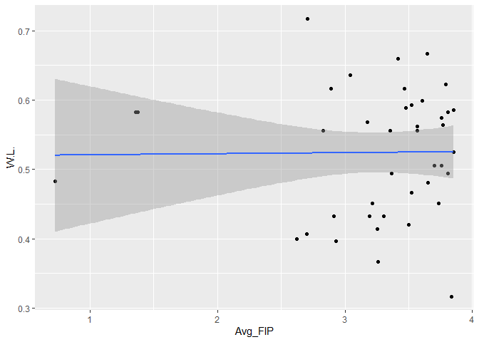

    team_merge %>% filter(Avg_FIP <= mean(Avg_FIP)) %>% ggplot(., aes(x=Avg_FIP, y= W.L1)) + 
      geom_point() + geom_smooth(method="lm", formula = "y ~ x")

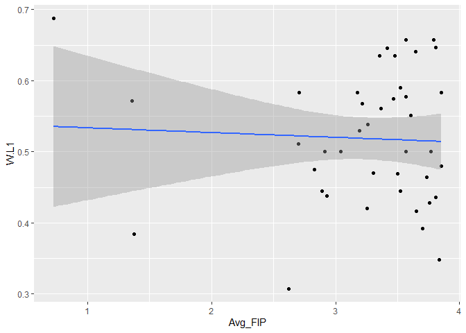

Overall W/L% hews positive and 1-Run performance is essentially flat,
leaving us with no strong correlations in our analysis.

# Topics From Class

## R Markdown

I’ve used the LaTeX functions in R Markdown to spruce up the formatting
for the FIP function definitions. Additionally some table formatting,
typeface decorations, and link were used to round out the written
portions of the investigation and provide sources. The rmarkdown library
itself was used to generate a GitHub README.md file.

## GitHub

The R Project file, along with .gitignore tailored for R Markdown
projects were checked in to GitHub along with the project’s RMarkdown
and PDF files. A Markdown README file was generated to take advantage of
Github’s default documentation rendering. Once setup, R Studio’s Git
interface provided a nice, lightweight method to commit and push files
to GitHub.

## Mean, Median, Quantiles, Normal Distribution, Standard Deviation

The data set statistics were initially reviewed, with the Mean and
Median being close to each other to help demonstrate that we are indeed
dealing with a normally distributed set Independent set, only slightly
right-skewed. The quantiles help demonstrate the fact that as a whole,
middle relievers have poorer independent outcomes that league-average
pitchers, perhaps dooming the significance found in the analysis at the
outset. The definition of “elite” and “good” pitchers employed
calculating the standard deviation of roughly 1.11 FIP to allow for
analysis of these individual segments.

## Tidyverse and R Custom Function

To help with the necessary data wrangling, the Tidyverse **dplyr**,
**stringr**, and **ggplot** libraries were used, along with a custom
function definition to more easily derive the 1-Run game Win/Loss% from
the string present in the standings data set. The online documentation
and examples are both excellent and plentiful for all Tidyverse
libraries, and it made their usage even easier.

## Regression

Ultimately, Regression was used in the final analysis to attempt to
ascertain if there was a significant connection Middle Reliever
performance and team performance. There was not, but looking at linear
regression slope, R-squared values, and Residual distribution helped
prove that there was no proof of strong correlation.

# Conclusion: Middle Relievers, Not Provably Important

With no strong correlations and residual data all over the place, we
cannot draw a conclusion that our Middle Relievers have a statistically
significant impact on a team’s ability to win games, even those games
decided by one run. In the opinion of this author, it’s frankly shocking
that the correlations we created through analysis were so poor, at least
in the context of FIP. With pitching the essential front line to team
defense, perhaps a stronger correlation would be found if team fielding
quality were brought into the equation. With that said, the data
certainly points more strongly to success through the core tenants of
the Oakland A’s original
[**Moneyball**](https://en.wikipedia.org/wiki/Moneyball) team: get on
base and hit home runs.

The exercise, though mediocre in the performance of it’s desired goals,
did provide a great chance to dig in to the tools of the Tidyverse. I
have a strong background in databases and SQL tools, and so being able
to use the Tidyverse toolkit to be able to chain functions together were
invaluable to being able to do analysis in an efficient manner. My
initial desire was to compute a large and more raw data set provided by
MLB’s [**Baseball
Savant**](%22https://baseballsavant.mlb.com/statcast_search%22), but
these sets proved too large and unwieldy to pre-process. The need for an
alternative had me digging in to the tools provided by Fangraphs and
Baseball Reference, which are wonderful and expansive resources for
baseball researchers.
